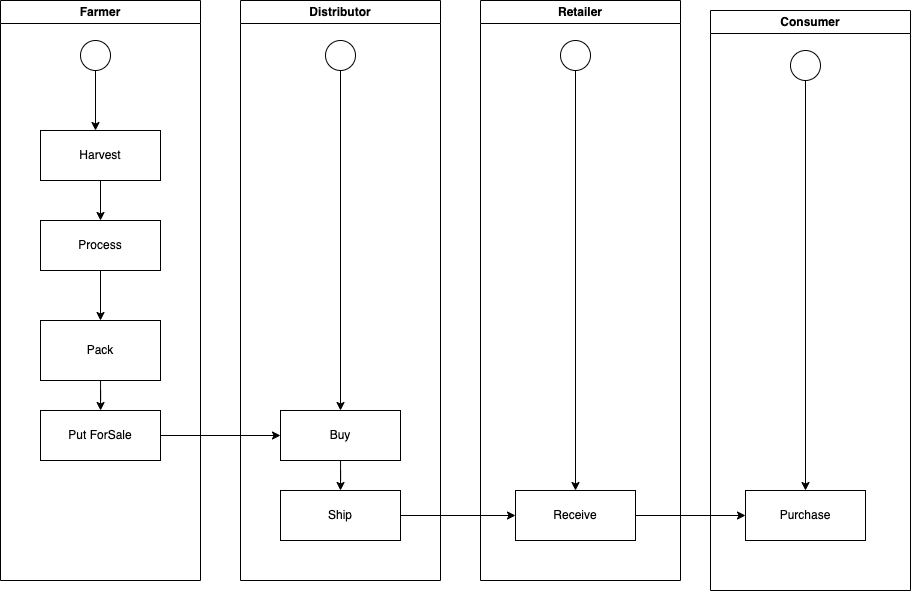
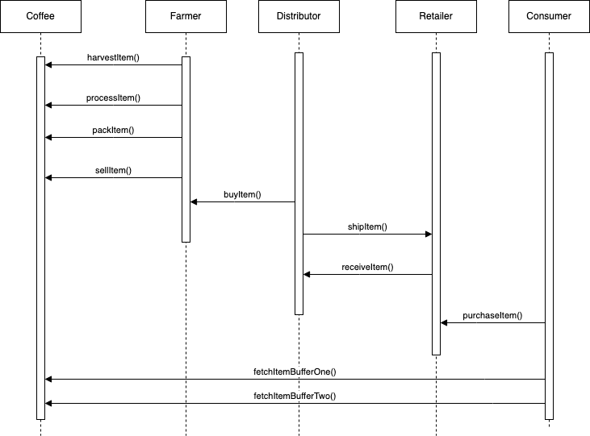
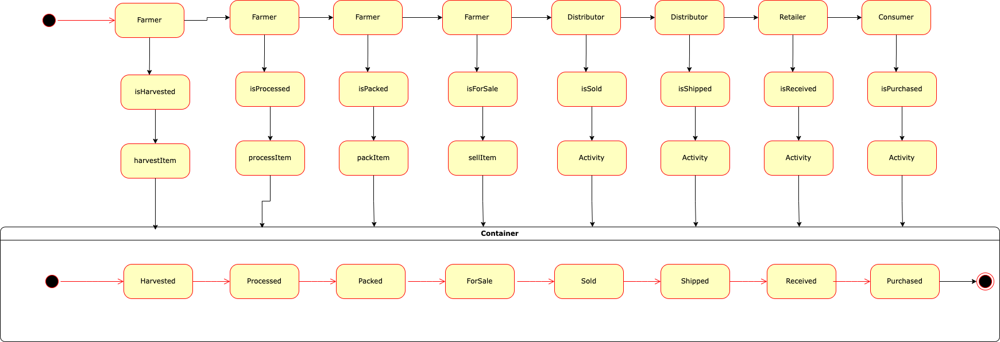
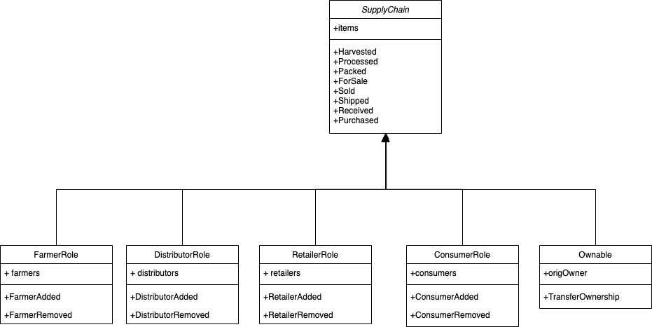

# Architect a Blockchain Supply Chain Solution 

## UML

### Activity Diagram


### Sequence Diagram


### State Diagram


### Class Diagram



## Libraries
```
 web3 version               : "0.20.6" (version of web3 library used for connecting to blockchain)
 
 truffle-assertions version : "^0.9.2" (used for assertion of events emitted by contracts during test)
 
 node version               : "16.14.2"
```


 ## IPFS

 IPFS was not used for this project.

 ## General write-up

 This repository containts an Ethereum DApp that demonstrates a Supply Chain flow of Coffee from a Farmer to Consuer. It includes the contract definitions, frontend and truffle configuration for sepolia and development network. The Farmer harvests, processes, packs and puts coffee for sale, distributor buys and ships coffee, retailer receives coffee and consumer purchases it. The state of coffee keeps changing at every stage.  

Deployment 

Ethereum network - Sepolia
Supply Chain Contract address - 0x33914A839acecE9e3b57BEB6e27320649146E906

Trasaction history -
* Harvested - 0x1e4af317e233ce14c1a24dfa1e63e7b03911744d3039512d1bc4711ee5aa7e5e
* Processed - 0x4f3c4e8107738937dfc4f26c435a6f967c9746cc7abeab17fda333d07f08014f
* Packed - 0x72186506f38bdbfb707bb5f20a041e280363c8a32acdf688428bc210d9fd5e08
* ForSale - 0xc4ace6b95bbfcbb5cdd25984aadeb90cfda6e7e6de1fc7803bea6f2c8e459672
* Sold - 0x381b3515f49a50e2a26093734247852aa9fac8078f806328a69a97a04f22d9c2
* Shipped - 0x62d72a354a47e4a7c828a1e308075a1f931c813e02e17de794148dc8acfd38e4
* Received - 0x0b6863cfb1ad76f66ecb668ab2a6280b0f16bc3968ba2cb766d693295db40f16
* Purchased - 0x25b3bf193aa033c8c8aa16095fec27a3fd65cd6ad87fd709240d235d22b25a79


### Steps to run 

Change directory to ```project-6``` folder and install all requisite npm packages:

```
cd project-6
npm install
```

To compile all contracts, run:

```
truffle compile
```

and:

```
truffle test
```

to test the changes.

The frontend can be accessed at http://localhost:3000 after running below command:

```
npm run dev
```

To deploy to the sepolia network:

```
truffle migrate --network sepolia
```